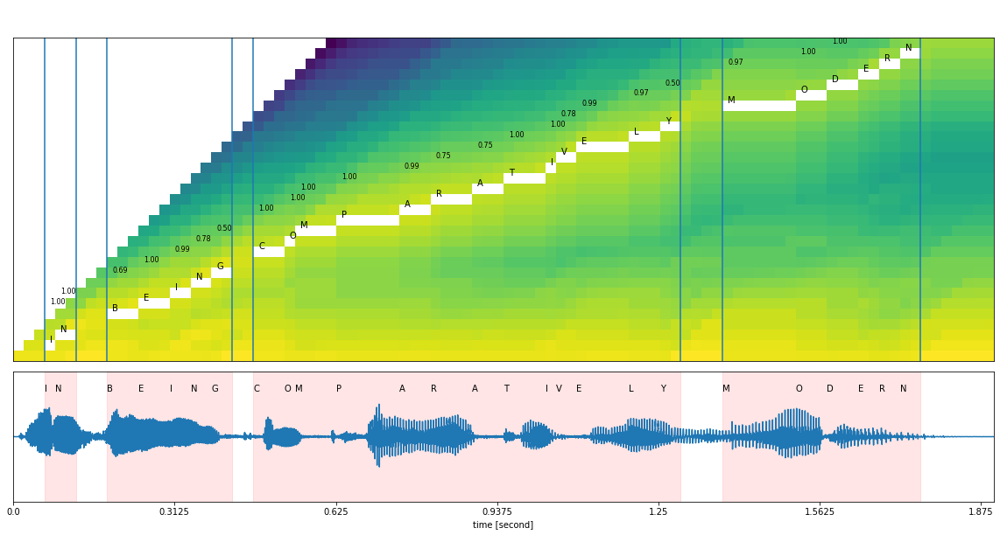
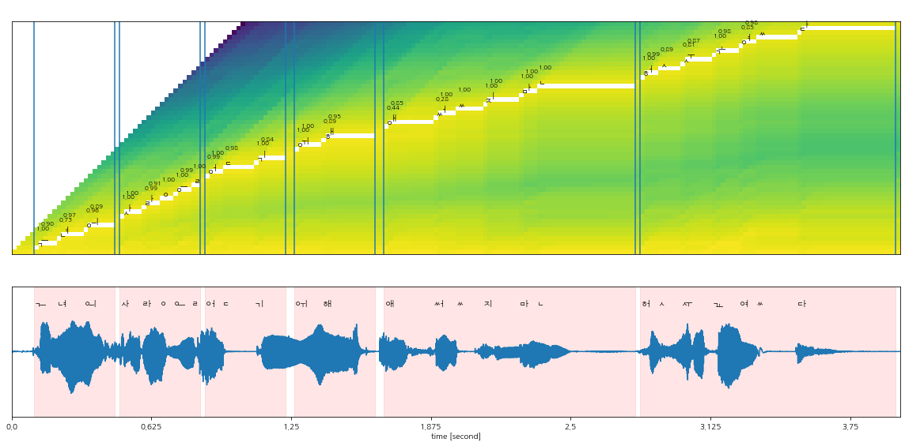

# Non-attentive Tacotron - PyTorch Implementation

This is Pytorch Implementation of Google's [Non-attentive Tacotron](https://arxiv.org/abs/2010.04301), text-to-speech system.
There is some minor modifications to the original paper. We use grapheme directly, not phoneme. 
For that reason, we use grapheme based forced aligner by using [Wav2vec 2.0](https://arxiv.org/abs/2006.11477).
We also separate special characters from basic characters, and each is used for embedding respectively.
This project is based on [NVIDIA tacotron2](https://github.com/NVIDIA/tacotron2). Feel free to use this code.

## Install
- Before you start the code, you have to check your python>=3.6, torch>=3.8, torchaudio>=0.10.0 version.
- Torchaudio version is strongly restrict because of recent modification. 
- We support docker image file that we used for this implementation.
- or You can install a package through the command below:
```bash
## download the git repository
git clone https://github.com/JoungheeKim/Non-Attentive-Tacotron.git
cd Non-Attentive-Tacotron

## install python dependency
pip install -r requirements.txt

## install this implementation locally for further development
python setup.py develop
```

## Quickstart
- Install a package.
- Download Pretrained tacotron models through links below:
  - [LJSpeech-1.1](https://keithito.com/LJ-Speech-Dataset/) (English, single-female speaker)
    - trained for 40,000 steps with 32 batch size, 8 accumulation) [[LINK]]()
  - [KSS Dataset](https://www.kaggle.com/bryanpark/korean-single-speaker-speech-dataset) (Korean, single-female speaker)
    - trained for 40,000 steps with 32 batch size, 8 accumulation) [[LINK]](https://drive.google.com/file/d/1BBYDTaBS0co7_VgaRowqk8NvFGA5bBgF/view?usp=sharing)
- Download Pretrained VocGAN vocoder corresponding tacotron model in this [[LINK]](https://github.com/rishikksh20/VocGAN)
- Run a python code below:
```python
## import library
from tacotron import get_vocgan
from tacotron.model import NonAttentiveTacotron
from tacotron.tokenizer import BaseTokenizer
import torch

## set device
device = torch.device('cuda' if torch.cuda.is_available() else 'cpu')

## set pretrained model path
generator_path = '???'
tacotron_path = '???'

## load generator model
generator = get_vocgan(generator_path)
generator.eval()

## load tacotron model
tacotron = NonAttentiveTacotron.from_pretrained(tacotron_path)
tacotron.eval()

## load tokenizer
tokenizer = BaseTokenizer.from_pretrained(tacotron_path)

## Inference
text = 'This is a non attentive tacotron.'
encoded_text = tokenizer.encode(text)
encoded_torch_text = {key: torch.tensor(item, dtype=torch.long).unsqueeze(0).to(device) for key, item in encoded_text.items()}

with torch.no_grad():
    ## make log mel-spectrogram
    tacotron_output = tacotron.inference(**encoded_torch_text)
    
    ## make audio
    audio = generator.generate_audio(**tacotron_output)
```
- We support more details in our [tutorials](tutorial/)

## Preprocess & Train
#### 1. Download Dataset 
- First, download your own Dataset for training.
- We tested our code on [LJSpeech-1.1](https://keithito.com/LJ-Speech-Dataset/) and [KSS ver 1.4](https://www.kaggle.com/bryanpark/korean-single-speaker-speech-dataset) Dataset.

#### 2. Build Forced Aligned Information.
- Non-Attentive Tacotron is duration based model.
- So, alignment information between grapheme and audio is essential.
- We make alignment information using [Wav2vec 2.0](https://arxiv.org/abs/2006.11477) released from [fairseq](https://github.com/pytorch/fairseq/tree/main/examples/wav2vec).
- We also support pretrained wav2vec 2.0 model for Korean in this [[LINK]](https://drive.google.com/file/d/1BBYDTaBS0co7_VgaRowqk8NvFGA5bBgF/view?usp=sharing).
- The Korean Wav2vec 2.0 model is trained on aihub korean dialog dataset to generate grapheme based prediction described in [K-Wav2vec 2.0](https://arxiv.org/abs/2110.05172).
- The English model is automatically downloaded when you run the code.
- Run the command below:
```bash
## 1. LJSpeech example
## set your data path and audio path(examples are below:)
AUDIO_PATH=/code/gitRepo/data/LJSpeech-1.1/wavs
SCRIPT_PATH=/code/gitRepo/data/LJSpeech-1.1/metadata.csv

## ljspeech forced aligner
## check config options in [configs/preprocess_ljspeech.yaml]
python build_aligned_info.py \
    base.audio_path=${AUDIO_PATH} \
    base.script_path=${SCRIPT_PATH} \
    --config-name preprocess_ljspeech
    
    
## 2. KSS Dataset 
## set your data path and audio path(examples are below:)
AUDIO_PATH=/code/gitRepo/data/kss
SCRIPT_PATH=/code/gitRepo/data/kss/transcript.v.1.4.txt
PRETRAINED_WAV2VEC=korean_wav2vec2

## kss forced aligner
## check config options in [configs/preprocess_kss.yaml]
python build_aligned_info.py \
    base.audio_path=${AUDIO_PATH} \
    base.script_path=${SCRIPT_PATH} \
    base.pretrained_model=${PRETRAINED_WAV2VEC} \
    --config-name preprocess_kss
```
- We also support our preprocessed forced algined files for [KSS ver1.4 dataset](https://drive.google.com/file/d/1Ou3X_xHDmfYLSLIp3WW8KO6dSvco7iQQ/view?usp=sharing) and [LJSpeech1.1](https://drive.google.com/file/d/1IOLrORHq-_No16yBaiNX6D1p6PIHxT56/view?usp=sharing)
#### 3. Train & Evaluate
- It is recommeded to download the pre-trained vocoder before training the non-attentive tacotron model to evaluate the model performance in training phrase.
- You can download pre-trained VocGAN in this [[LINK]](https://github.com/rishikksh20/VocGAN).
- We only experiment with our codes on a one gpu such as 2080ti or TITAN RTX.
- The robotic sounds are gone when I use batch size 32 with 8 accumulation corresponding to 256 batch size.
- Run the command below:
```bash
## 1. LJSpeech example
## set your data generator path and save path(examples are below:)
GENERATOR_PATH=checkpoints_g/ljspeech_29de09d_4000.pt
SAVE_PATH=results/ljspeech

## train ljspeech non-attentive tacotron
## check config options in [configs/train_ljspeech.yaml]
python train.py \
    base.generator_path=${GENERATOR_PATH} \
    base.save_path=${SAVE_PATH} \
    --config-name train_ljspeech
  
  
    
## 2. KSS Dataset   
## set your data generator path and save path(examples are below:)
GENERATOR_PATH=checkpoints_g/vocgan_kss_pretrained_model_epoch_4500.pt
SAVE_PATH=results/kss

## train kss non-attentive tacotron
## check config options in [configs/train_kss.yaml]
python train.py \
    base.generator_path=${GENERATOR_PATH} \
    base.save_path=${SAVE_PATH} \
    --config-name train_kss

```
- Parameter informations are stored in `tacotron/configs.py`
# Audio Examples
 Language | Text with Accent(bold) | Audio Sample  | 
|----------|-------------------------------------------|---------|
| Korean   | 이 타코트론은 잘 작동한다.                   | [Sample](https://user-images.githubusercontent.com/30570052/147639514-6b2212ef-5a66-4226-9343-49b639e26370.mp4) |
| Korean   | <b><ins>이</ins></b> 타코트론은 잘 작동한다. | [Sample](https://user-images.githubusercontent.com/30570052/147639573-e9fd2e79-cba5-437d-a9c6-5b9bf869e5c6.mp4) |
| Korean   | 이 <b><ins>타코</ins></b>트론은 잘 작동한다. | [Sample](https://user-images.githubusercontent.com/30570052/147639588-b8b8abb2-3ea1-47db-b14b-719fbde93054.mp4) |
| Korean   | 이 타코트론은 <b><ins>잘</ins></b> 작동한다. | [Sample](https://user-images.githubusercontent.com/30570052/147639606-0a1b09f0-0151-4e1c-923d-b2e482db0194.mp4) |


# Forced Aligned Information Examples



# ToDo
- [ ] Sometimes get torch `NAN` errors.(help me)
- [ ] Remove robotic sounds in synthetic audio.

# References
- [Non-Attentive Tacotron: Robust and Controllable Neural TTS Synthesis Including Unsupervised Duration Modeling](https://arxiv.org/abs/2010.04301), Shen, Jonathan, *et al*.
- [HGU-DLLAB's FastSpeech2 implementation](https://github.com/HGU-DLLAB/Korean-FastSpeech2-Pytorch)
- [NVIDIA's Tacotron2 implementation](https://github.com/NVIDIA/tacotron2)
- [rishikksh20's VocGAN implementation](https://github.com/rishikksh20/VocGAN)
